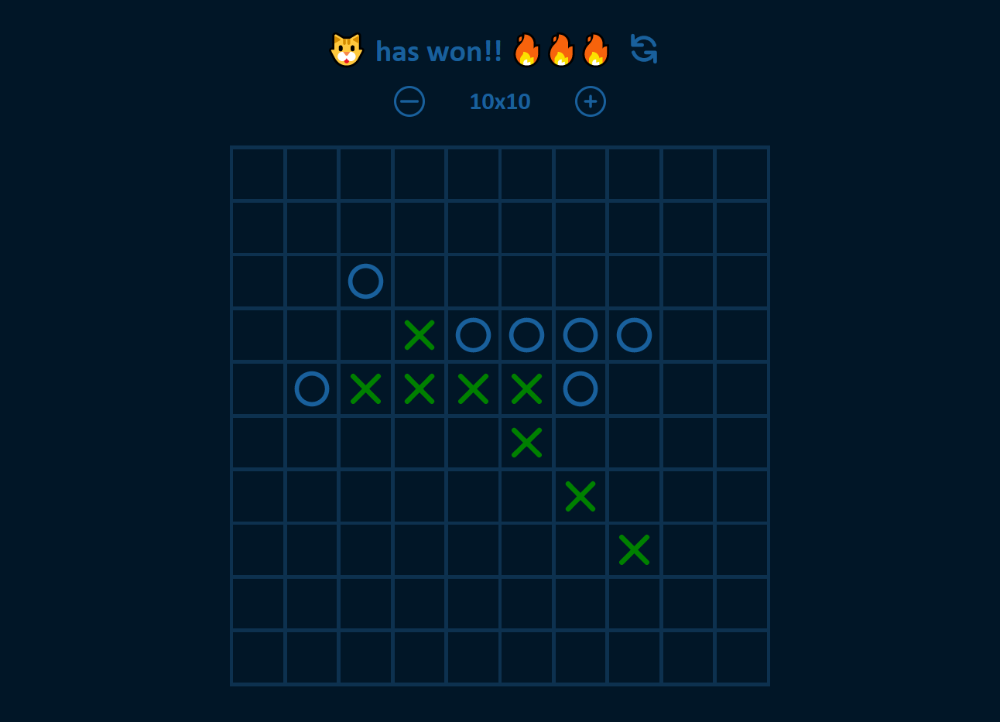
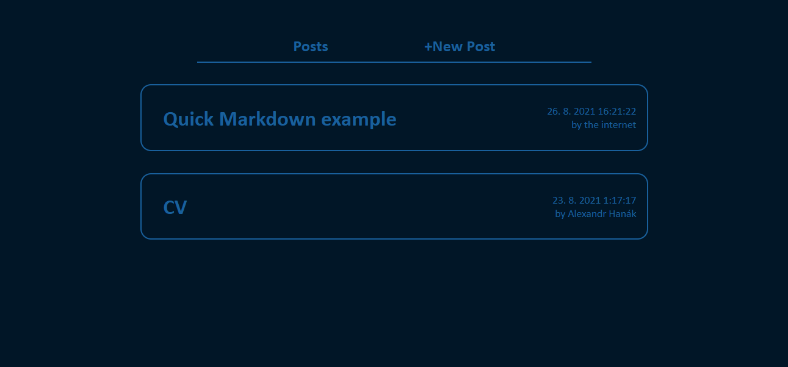
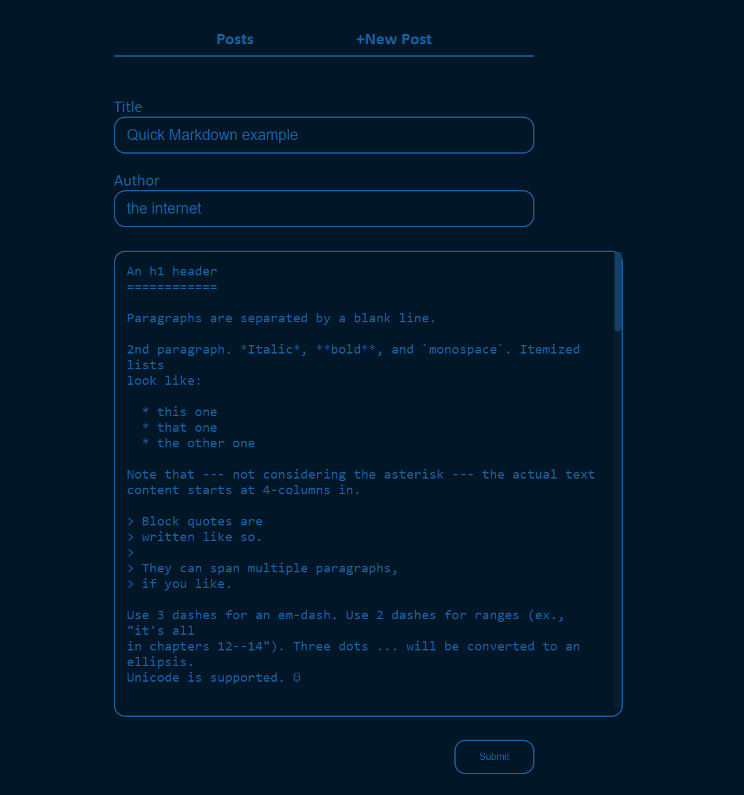
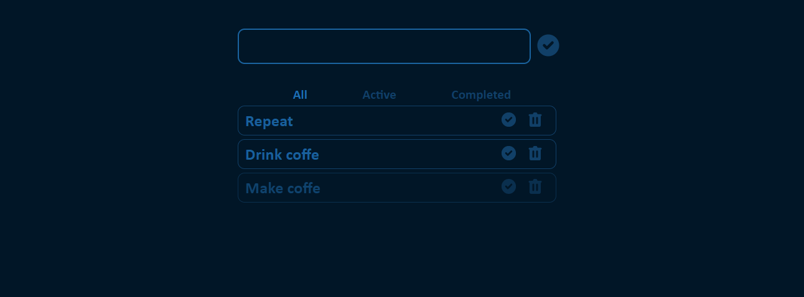

# ITA 2021 React practice

Clone this repo to get started.

## How to

```sh
git clone https://github.com/n3oAlex/ita2021-react-practice
```

### Install

```sh
npm install
```

### Start

```sh
npm run start
```

## React apps

### TicTacToe game

[link](https://github.com/n3oAlex/ita2021-react-practice/tree/main/src/tictac)

Game of Tic-tac-toe for 2 players with variable gameboard size.




### Pexeso game

[link](https://github.com/n3oAlex/ita2021-react-practice/tree/main/src/pexeso)

Simple game of pexeso with unicode emoticons.


### Chuck Norris Jokes API frontend

[link](https://github.com/n3oAlex/ita2021-react-practice/tree/main/src/chuck)

App that fetches 5 jokes per category and 20 random jokes from the ChuckNorris free JSON API.

ChuckNorrisAPI: <https://api.chucknorris.io/>


### Blog

[link](https://github.com/n3oAlex/ita2021-react-practice/tree/main/src/blog)

A very bare bones blogging system allowing writing/editing articles in markdown and then listing/viewing/removing them. LocalStorage is used in place of a database.





### HackerTyper clone

[link](https://github.com/n3oAlex/ita2021-react-practice/tree/main/src/hack)

Inspiration: <https://hackertyper.com/>


### Todo app

[link](https://github.com/n3oAlex/ita2021-react-practice/tree/main/src/todo)

Simple todo app that allows adding, removing and filtering tasks and also saves them to localStorage.



### Clicks per second meter

[link](https://github.com/n3oAlex/ita2021-react-practice/tree/main/src/click)


### Simple counter using Redux

[link](https://github.com/n3oAlex/ita2021-react-practice/tree/main/src/redux)


